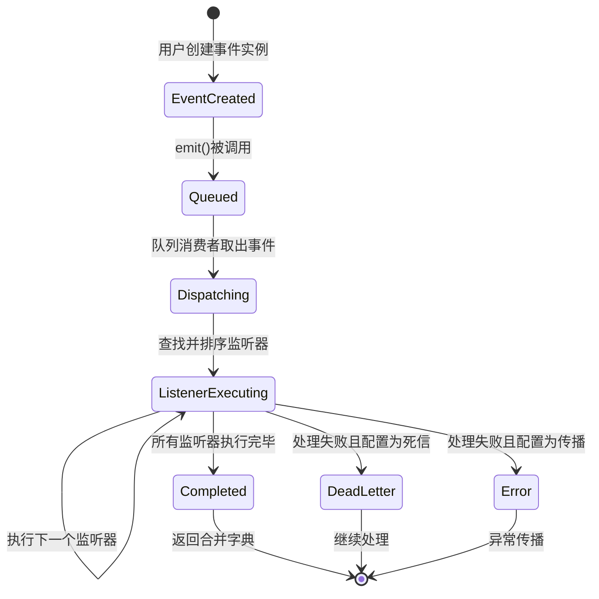

# PRD — Python事件驱动框架 (Eventd)

## 1. 概述

一个支持同步/异步模式、基于类继承事件模型、具备完整类型注解的Python事件驱动框架，为基础设施开发者提供灵活、可扩展的事件分发能力。

## 2. 用户与角色

- **基础设施开发者**：使用本框架构建事件驱动系统的Python开发者
  - 权限：完全控制事件定义、监听器注册、执行策略
  - 需求：需要类型安全、灵活配置、高性能的事件分发机制

## 3. 功能需求（按优先级排序）

### F-001: 事件定义

**优先级**: P0

- **触发条件**: 用户定义一个继承自`Event`的类
- **输入**: 事件类定义，包含用户自定义的数据属性
- **处理逻辑**:
  - 使用pydantic进行数据验证
  - `event_id`和`timestamp`在事件提交时由框架生成（见F-004、F-005）
- **输出/结果**: 一个可用的事件类，可通过构造函数创建事件实例
- **异常处理**:
  - 数据验证失败时抛出`EventValidationError`（捕获 pydantic `ValidationError` 后包装为 eventd 自有异常）

### F-002: 监听器注册（装饰器方式）

**优先级**: P0

- **触发条件**: 用户在函数上使用`@dispatcher.on(EventClass)`或`@dispatcher.on(EventClass1, EventClass2)`装饰器
- **输入**:
  - 单个事件类，或事件类列表
  - 回调函数（同步事件管理器只能注册同步监听器，异步事件管理器只能注册异步监听器）
  - 可选参数：`priority`（整数，**越大优先级越高**）、`after`（回调函数列表，这些监听器必须在当前监听器之前执行）
- **处理逻辑**: 将回调函数注册到该dispatcher实例的指定事件类型的监听器列表
- **输出/结果**: 被装饰的函数（保持原函数可用）
- **异常处理**:
  - 如果`after`中指定的回调函数**未被注册到任何事件**，注册时立即抛出`ValueError`
  - 如果`after`形成循环依赖，注册时立即抛出`CyclicDependencyError`
  - 如果回调函数类型与事件管理器类型不匹配（同步vs异步），注册时立即抛出`TypeError`
- **设计说明**: `on`是dispatcher实例方法，不是独立的全局装饰器。框架提供一个默认的`Dispatcher`实例（模块级别），用户可直接使用其方法（`from eventd import dispatcher`），也可自行创建新的dispatcher实例

### F-003: 监听器注册（方法调用方式）

**优先级**: P0

- **触发条件**: 用户调用`dispatcher.register(event_class, callback, **options)`或`dispatcher.register([event_class1, event_class2], callback, **options)`
- **输入**:
  - 单个事件类，或事件类列表
  - 回调函数
  - 可选参数：同F-002
- **处理逻辑**: 同F-002
- **输出/结果**: 无
- **异常处理**: 同F-002

### F-003A: 监听器取消订阅

**优先级**: P0

- **触发条件**: 用户调用`dispatcher.unregister()`
- **输入**:
  - 可选：单个事件类，或事件类列表（`event_types`）
  - 可选：要移除的回调函数（`callback`）
- **处理逻辑**: 支持四种调用模式：

  | `event_types` | `callback` | 行为 |
  |---------------|------------|------|
  | 有 | 有 | 从指定事件类型中移除指定回调 |
  | 有 | `None` | 从指定事件类型中移除**所有**监听器 |
  | `None` | 有 | 从**所有**事件类型中移除指定回调 |
  | `None` | `None` | 抛出 `ValueError`（无意义调用） |

- **输出/结果**: 无
- **异常处理**:
  - 如果 `event_types` 和 `callback` 均为 `None`，抛出`ValueError`
  - 如果指定的回调函数未注册到指定事件类型，抛出`ValueError`
  - 如果移除该监听器导致其他监听器的`after`依赖失效，抛出`ValueError`（被依赖的监听器不可移除）
- **设计说明**: `@on`装饰器返回的句柄（原函数）不用于取消订阅，取消订阅必须通过`unregister`方法显式调用

### F-004: 事件提交（同步模式）

**优先级**: P0

- **触发条件**: 用户调用`dispatcher.emit(event)`（同步事件管理器）
- **输入**:
  - 事件实例（`Event`子类的实例）
- **处理逻辑**:
  1. 为事件生成`event_id`（使用用户自定义生成函数或默认自增）
  2. 为事件生成`timestamp`（使用用户自定义生成函数或默认`time.time()`）
  3. 根据事件类的MRO（方法解析顺序）查找所有匹配的监听器（按MRO顺序，子类监听器在前，父类监听器在后）
  4. 在每个MRO层级内，按优先级（高到低）和`after`依赖排序监听器，检测循环依赖
  5. 依次执行同步监听器（阻塞执行）
  6. 收集每个监听器的返回值（必须为字典），合并所有返回值
  7. 如果监听器抛出异常，根据**事件管理器级别配置**决定：传播/捕获/重试
- **输出/结果**: 合并后的字典（所有监听器返回值的合并）
- **异常处理**:
  - 默认：监听器异常直接向上传播
  - 配置为捕获时：异常被记录，继续执行下一个监听器，异常信息会包含在返回字典的特定键中
  - 配置为重试时：按重试策略执行（无延迟，立即重试），最终失败进入死信队列（如启用）或包含在返回字典中
  - 如果合并返回值时出现键冲突，抛出`KeyConflictError`
- **设计说明**:
  - `event_id`在emit函数接收事件实例时被创建与分配。由于同步和异步都是单线程模型，协程的并发发生在emit内部管理，因此`event_id`的自增是协程安全的
  - 用户自定义`event_id`生成函数的签名为`() -> int`，每次调用返回一个新值
  - 用户自定义`timestamp`生成函数的签名为`() -> float`，每次调用返回一个新值
  - 如果同一个监听器通过MRO匹配了多次（如分别注册在父类和子类上），不进行去重，因为监听注册并不是继承的，多次触发是用户意图

### F-005: 事件提交（异步模式）

**优先级**: P0

- **触发条件**: 用户在async函数中调用`await dispatcher.emit(event)`
- **输入**: 同F-004
- **处理逻辑**:
  1. 同F-004的步骤1-2（event_id和timestamp生成）
  2. 同F-004的步骤3-4（MRO查找和排序）
  3. 按priority和after决定的优先级分层：同一优先级层的监听器使用`asyncio.gather()`并行执行，await该批次完成后，再发射下一优先级层
  4. 同F-004的步骤6-7（返回值合并和异常处理）
- **输出/结果**: 合并后的字典（所有监听器返回值的合并）
- **异常处理**:
  - 同F-004
  - 并行执行时如果出现`KeyConflictError`，抛出错误

### F-006: 事件队列（递归深度控制）

**优先级**: P1

- **触发条件**: 监听器中触发新事件（事件A的监听器调用`emit(event_B)`）
- **输入**:
  - 新事件实例
  - 队列配置：`max_size`（默认无限制，用于限制递归深度）
- **处理逻辑**:
  - **同步模式**：
    - 单线程阻塞执行，所有监听器在同一线程中依次执行
    - 当监听器触发新事件时，新事件被追加到内部执行列表（队列）
    - emit继续执行列表中的事件，直到列表为空
    - 队列满时抛出`QueueFullError`（因为无法阻塞单线程执行）
  - **异步模式**：
    - 事件放入asyncio.Queue
    - 消费者任务按顺序处理
    - 队列满时阻塞等待
- **输出/结果**: 事件被排队，稍后执行
- **异常处理**:
  - 同步模式队列满：抛出`QueueFullError`
  - 异步模式队列满：阻塞等待（或配置为丢弃/报错）
- **设计说明**: 事件队列的核心价值在于控制"事件引发其他事件"时的递归深度。当事件A的监听器触发事件B时，B被追加到待执行列表而非立即递归执行，避免栈溢出。在同步模式下，这是**单线程顺序执行**，不存在消费者线程。

### F-007: 死信队列

**优先级**: P1

- **触发条件**: 事件处理失败且配置为进入死信队列
- **输入**:
  - 失败的事件实例
  - 失败原因（异常信息）
  - 处理时的上下文信息
- **处理逻辑**:
  - 将事件和错误信息存入死信队列数据结构
  - 用户可通过API读取和处理死信队列
- **输出/结果**: 事件进入死信队列，原流程继续或结束（用户配置）
- **异常处理**: 死信队列操作本身的异常直接传播

### F-008: 优雅停机（异步模式）

**优先级**: P1

- **触发条件**: 用户显式调用`await dispatcher.shutdown()`
- **输入**:
  - 可选：超时时间（默认无限等待）
- **处理逻辑**:
  1. 标记事件管理器为"停止接受新事件"状态
  2. 等待当前正在执行的监听器完成（不强制中断）
  3. 等待事件队列中的所有事件处理完成
  4. 清理资源
- **输出/结果**: 事件管理器安全关闭
- **异常处理**: 停机超时抛出`ShutdownTimeoutError`
- **设计说明**: 框架不自动注册SIGTERM等信号处理器，停机完全由用户手动调用`shutdown()`触发。用户可在自己的信号处理器中调用`shutdown()`

### F-008-SYNC: 优雅停机（同步模式）

**优先级**: P1

- **触发条件**: 用户显式调用`dispatcher.shutdown()`
- **输入**:
  - 可选：超时时间（默认无限等待）
- **处理逻辑**:
  1. 同F-008的步骤1
  2. 同F-008的步骤2（包括由当前事件递归触发的其他事件）
  3. 同F-008的步骤3
  4. 同F-008的步骤4
- **输出/结果**: 事件管理器安全关闭
- **异常处理**: 同F-008
- **设计说明**: 同步模式为单线程阻塞执行，不会响应外部停止信号，但停止信号有可能在回调处理中被触发（例如监听器内部调用`shutdown()`）

### F-009: 异常处理配置

**优先级**: P1

- **触发条件**: 用户创建事件管理器时配置
- **输入**:
  - `error_strategy`: `ErrorStrategy.PROPAGATE`（默认）| `ErrorStrategy.CAPTURE` | `ErrorStrategy.RETRY`（`ErrorStrategy` 为 `StrEnum`）
  - `retry_config`: 当strategy为`"retry"`时必需
    - `max_retries`: 最大重试次数
    - `should_retry`: 可选函数，接收`(exception, context: ExecutionContext) -> bool`，决定是否重试
  - `dead_letter_enabled`: 是否启用死信队列（默认False）
- **处理逻辑**: 配置保存到事件管理器实例
- **输出/结果**: 事件管理器使用指定策略处理监听器异常
- **异常处理**: 配置参数非法时抛出`ValueError`
- **设计说明**: 当前为单线程实现，重试策略不支持延迟（无`delay`参数）。重试为立即重试，仅重试失败的监听器（不重新触发整个事件）

### F-010: 日志记录

**优先级**: P2

- **触发条件**: 框架关键操作（事件提交、监听器执行、异常等）
- **输入**: 日志消息和上下文
- **处理逻辑**: 使用loguru记录日志
- **输出/结果**: 日志输出（用户可配置级别和输出目标）
- **异常处理**: 日志记录失败不中断主流程

## 4. 非功能需求

### 4.1 性能

- 事件分发延迟：< 1ms（单机，无队列）
- 支持每秒10,000+事件处理（取决于监听器复杂度）

### 4.2 技术栈

| 组件 | 技术 | 版本 | 理由 |
|------|------|------|------|
| 异步运行时 | asyncio | Python标准库 | 官方支持，生态完善 |
| 数据验证 | pydantic | ^2.0 | 类型安全，性能优秀 |
| 日志 | loguru | ^0.7 | 简单易用，功能强大 |
| Python版本 | CPython | 3.12+ | 使用最新语法特性，无历史包袱 |
| 包管理 | uv | latest | 快速、现代的Python包管理工具 |
| 测试框架 | pytest | ^8.0 | 生态丰富、插件支持 |
| 异步测试 | pytest-asyncio | ^0.24 | pytest的asyncio测试支持 |

### 4.3 类型安全

- 100%类型注解覆盖
- 支持泛型事件类型
- IDE友好（自动补全、类型检查）

### 4.4 可靠性

- 无外部运行时依赖（除loguru和pydantic）
- 纯Python实现，跨平台

### 4.5 测试策略

#### 4.5.1 测试分类与覆盖要求

| 测试类型 | 覆盖目标 | 工具 |
|----------|----------|------|
| **单元测试** | 每个公开API的前置条件、后置条件、不变量各至少1条测试 | pytest |
| **异步测试** | 所有异步API的等价测试 | pytest-asyncio |
| **边界测试** | PRD第7节所列所有边界情况 | pytest |
| **集成测试** | 跨组件交互（事件队列+监听器+异常处理的组合） | pytest |
| **性能基准** | 验证非功能需求4.1中的性能指标 | pytest-benchmark 或自定义脚本 |

#### 4.5.2 必须覆盖的测试场景

**事件定义（F-001）**：

- 正常创建事件实例
- pydantic数据验证失败抛出EventValidationError

**监听器注册（F-002/F-003）**：

- 单事件类注册、多事件类列表注册
- priority排序正确性
- after依赖排序正确性
- after引用未注册监听器时抛出ValueError
- 循环依赖检测抛出CyclicDependencyError
- 同步/异步类型不匹配抛出TypeError

**取消订阅（F-003A）**：

- 正常取消订阅（指定事件+回调）
- 取消指定事件的所有监听器
- 取消所有事件中的指定回调
- event_types和callback均为None时抛出ValueError
- 取消未注册的回调抛出ValueError
- 取消被依赖的监听器抛出ValueError

**事件提交 — 同步（F-004）**：

- 正常分发与返回值合并
- MRO继承链触发（子类事件触发父类监听器）
- MRO顺序正确性（子类监听器在前）
- 同一监听器通过MRO多次匹配不去重
- 无监听器时返回空字典
- 监听器返回非字典抛出TypeError
- 键冲突抛出KeyConflictError
- event_id自增正确性
- 自定义event_id/timestamp生成函数

**事件提交 — 异步（F-005）**：

- 同优先级并行执行（验证gather行为）
- 不同优先级分层顺序执行
- 并行执行时键冲突

**事件队列（F-006）**：

- 监听器中触发新事件（递归事件）
- 队列满时同步抛出QueueFullError
- 队列满时异步阻塞等待

**死信队列（F-007）**：

- 失败事件进入死信队列
- 死信队列内容可读取

**优雅停机（F-008/F-008-SYNC）**：

- 正常停机
- 停机后拒绝新事件
- 停机超时抛出ShutdownTimeoutError
- 停机时等待当前监听器完成

**异常处理（F-009）**：

- propagate策略：异常向上传播
- capture策略：异常被捕获，继续执行
- retry策略：立即重试指定次数
- should_retry条件函数（接收ExecutionContext）
- 重试耗尽后进入死信队列

#### 4.5.3 测试组织

```
tests/
├── unit/
│   ├── test_event.py          # F-001
│   ├── test_registration.py   # F-002, F-003, F-003A
│   ├── test_sync_emit.py      # F-004
│   ├── test_async_emit.py     # F-005
│   ├── test_queue.py          # F-006
│   ├── test_dead_letter.py    # F-007
│   ├── test_shutdown.py       # F-008, F-008-SYNC
│   └── test_error_handling.py # F-009
├── integration/
│   ├── test_full_sync_flow.py
│   └── test_full_async_flow.py
└── benchmark/
    └── test_performance.py    # 4.1性能指标验证
```

## 5. 约束与假设

### 5.1 约束

- **监听器阻塞**: 框架不处理监听器的无限循环或阻塞，这是用户责任
- **内存管理**: 默认不限制事件队列长度，内存溢出导致的崩溃由用户负责
- **事件版本**: 事件版本控制是用户责任，框架不提供内置支持
- **监听器返回值**: 所有监听器必须返回字典，否则抛出`TypeError`。用户负责保证各监听器返回的字典键不重复，框架不提供自动命名空间或合并策略配置——键冲突直接抛出`KeyConflictError`
- **同步/异步隔离**: 同步事件管理器只能注册同步监听器，异步事件管理器只能注册异步监听器
- **信号处理**: 框架不自动注册任何操作系统信号处理器（SIGTERM等），停机由用户手动触发
- **重试策略**: 当前为单线程实现，重试策略不支持延迟，仅立即重试

### 5.2 假设（已确认）

- 用户使用Python 3.12+
- 用户了解asyncio编程模型
- 用户负责监听器的幂等性和线程安全

## 6. 状态转移



## 7. 边界情况

| 场景 | 行为 |
|------|------|
| 无监听器订阅事件 | 事件被丢弃，返回空字典`{}`，记录警告日志（如启用日志） |
| 队列为空时关闭 | 立即关闭，无等待 |
| 监听器执行中关闭 | 等待监听器完成（包括递归触发的事件），不强制中断 |
| 循环依赖检测 | 注册时或emit时立即抛出`CyclicDependencyError` |
| 同步队列满 | 抛出`QueueFullError`（同步模式不支持阻塞，因为是单线程执行） |
| 异步队列满 | 阻塞等待（或按配置丢弃/报错） |
| 监听器返回非字典 | 抛出`TypeError` |
| 合并返回字典键冲突 | 抛出`KeyConflictError`（用户负责保证键唯一） |
| MRO继承链触发 | emit `EventB(EventA)`时，按MRO顺序触发：先`EventB`的监听器，再`EventA`的监听器 |
| 同一监听器多次MRO匹配 | 不去重，每次匹配都触发（多次注册是用户意图） |
| 取消被依赖的监听器 | 抛出`ValueError`（其他监听器的`after`依赖失效） |
| 取消订阅时 event_types 和 callback 均为 None | 抛出`ValueError`（无意义调用） |
| shutdown后emit | 抛出异常（事件管理器已关闭，不再接受新事件） |

## 8. 配置API参考

### 默认Dispatcher

```python
from eventd import dispatcher

# dispatcher 是一个模块级别的 Dispatcher 实例
# 用户可以直接使用其方法，无需自行创建
@dispatcher.on(UserEvent)
def handle_user(event: UserEvent) -> dict:
    return {"handled": True}

dispatcher.emit(event)
```

### 事件管理器配置

```python
# 同步模式（自行创建）
sync_dispatcher = Dispatcher(
    error_strategy=ErrorStrategy.RETRY,  # ErrorStrategy.PROPAGATE | .CAPTURE | .RETRY
    retry_config=RetryConfig(
        max_retries=3,
        should_retry=lambda exc, ctx: isinstance(exc, TimeoutError)
    ),
    dead_letter_enabled=True,
    queue_max_size=1000,  # None表示无限制
    event_id_generator=lambda: uuid4().int,  # 可选，签名 () -> int
    timestamp_generator=lambda: time.time(),  # 可选，签名 () -> float
)

# 异步模式
async_dispatcher = AsyncDispatcher(
    # 同同步模式配置参数
)
```

### 监听器注册与取消

```python
@sync_dispatcher.on(UserEvent, priority=10, after=[validate_user])
def handle_user(event: UserEvent) -> dict:
    return {"user_id": event.user_id}

# 取消订阅
sync_dispatcher.unregister(UserEvent, handle_user)
```

## 9. 术语表

| 术语 | 定义 |
|------|------|
| **事件(Event)** | 继承自`Event`基类的类实例，携带数据和元数据 |
| **监听器(Listener)** | 订阅特定事件类型并处理事件的回调函数，必须返回字典 |
| **事件管理器(Dispatcher)** | 负责事件分发和监听器调度的核心组件，分为Dispatcher和AsyncDispatcher |
| **死信队列(Dead Letter Queue)** | 存储处理失败事件的队列，供后续人工处理 |
| **MRO** | Method Resolution Order，Python类继承解析顺序 |
| **返回值合并** | emit()收集所有监听器返回的字典并合并为一个字典返回 |
